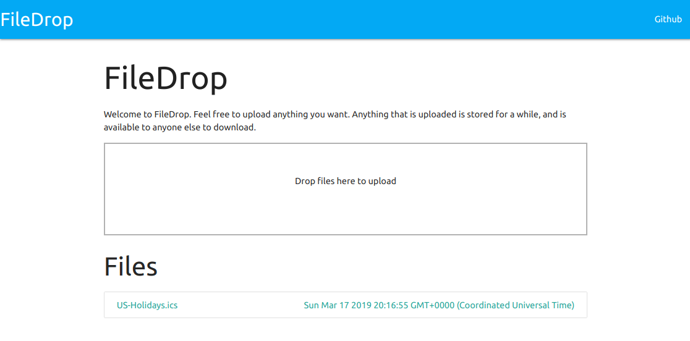

# FileDrop


FileDrop is a simple NodeJS application to upload and share files on local networks.

It is written to work completely offline.  That means you can host it on a private network or an internetless access point.



# Installing

## Locally

To use locally, you just need a recent (>8) NodeJS installation and to install the application.

```bash
npm install -g @zix99/filedrop
filedrop --target /path/to/savedir
```

## Docker

```bash
docker run -d -p 8080:8080 zix99/filedrop:latest
```

## From source

First, clone the repo...

Then:

```bash
npm install

# To start in foreground
npm start

# To start in background
npm run forever
```

To develop:
```bash
npm run dev
```

# Configuration

Filedrop uses the [rc](https://www.npmjs.com/package/rc) module for configuration.  To configure, simply use environment variables like `filedrop_`, use a `.filedroprc` file, or simply change `config.js`.

# License

[MIT](LICENSE.md)
